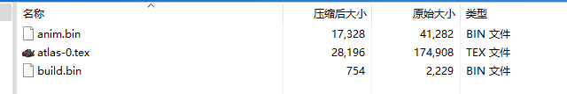

<h2> 动画文件格式 </h2>

本文使用cook_pot.zip作为示例（位于Don't Starve Together\data\anim文件夹下）。

打开zip文件，可以看到一般饥荒动画zip文件的结构如下图所示：

1. 一个anim.bin文件，包含动画数据。
2. 一个build.bin文件，包含贴图的构建数据。
3. 1~3个tex文件（**饥荒引擎只支持一个zip中包含最多3个tex文件**），为贴图集文件。

通常build需要和对应的tex文件一起使用。

**将zip文件拖入到工具网站**中，即可看到文件的结构已经内容。

    

 

## 1. Build

### (1) build

每个build.bin文件都有切仅有一个build名。如图，该build的名字为cook_pot, 游戏中设置build代码：`inst.AnimState:SetBuild("cook_pot")`。

### (2) symbol

每个build下包含**多个symbol, 每个symbol命名不同**。如图，该build文件中有5个symbol。

### (3) frame（框）

每个symbol下包含**多个frame（框），每个frame的num不同，一个frame为一个矩形**。如图，该symbol中有1个frame，num为0。（点击symbol可以查看该symbol的frame）。

**可以简单理解一个frame就是一张包含锚点信息的图片**，frame的数据含义如下：

1. **w, h**: 该frame的宽高。
2. **x, y**: 该frame的锚点坐标，为绝对坐标，图片中心为原点，x向左为正，y向上为正。
3. **duration**: 该frame的复用次数，默认为1，duration表示该frame在symbol中重复使用的次数。

   如图：lib中的num为0的frame的duration为1，如果duration为2，表示num为1的frame和num为0的frame相同，以此类推。
4. **verts**: 该frame的顶点数据（不在图片中显示，该数据的作用是在对应的tex中寻找矩形对应的纹理）。

    

 

## 2. Anim

### (1) bank

每个anim文件中都多个bank，**每个bank名字不同，bank为动画集**。如图，该文件中有1个bank，bank的名字为cook_pot, 游戏中设置bank代码：`inst.AnimState:SetBank("cook_pot")`。

### (2) animation（动画）

每个bank下包含多个animation(动画)，animation的数据含义如下：

1. **name**: 动画的名字。
2. **rate**: 该动画的帧率。

如图，该bank中有多个个animation，游戏中播放动画的代码：`inst.AnimState:PlayAanimation("idle_full")`。

### (3) frame（帧）

每个animation下包含多个frame（帧），播放动画及按照帧率，从第0帧播放到最后一帧。点击animation可以查看该animation的frame。frame的数据含义如下：

1. **idx**: 该帧的编号，从0开始。
2. **x, y**: 该帧的中心坐标。
3. **w, h**: 该帧的宽高。

这些数据用于**鼠标点击以及高亮显示**，可以点击网页右上角的 `CollisionBox`按钮查看碰撞框。

> 如果一个物品鼠标无法点击，则该可能为物品动画的碰撞框数据出错，在导出时勾选 `recalculate collision`即可自动重新计算碰撞框数据。

### (4) element

每个frame（帧）下包含多个element，**可以简单理解一个element就是一个图层**，每帧的图像由这些element按**从上到下**顺序堆叠组成。elemenet的数据含义如下：

1. **z**: 该element的层级，越小越在上层。
2. **symbol**: 该element使用的symbol名。
3. **frame**: 该element使用的frame-num。
4. **layer**: 该element的图层名。
5. **a, b, c, d**: 该element的变换矩阵，用于控制该element的缩放、旋转、倾斜等变换。
6. **tx, ty**: 该element的平移值，用于控制该element的位置。

element的作用：**从指定的build中对应的symbol下的frame-num获取矩形图像**，然后按照element的变换矩阵进行变换。

这里，就能解释一些游戏中动画代码的作用了，如：

`inst.AnimState:OverrideSymbol("old_symbol", "build", "new_symbol")`：将当前动画中所有的"old_symbol"替换为"build"中的"new_symbol"，可以实现部分贴图的替换。

`inst.AnimState:ClearOverrideSymbol("old_symbol")`：清楚当前动画中所有的"old_symbol"的替换。

`inst.AnimState:Hide("swap_high")`：隐藏动画中所有名为swap_high的图层。

`inst.AnimState:Show("swap_mid")`：显示动画中所有名为swap_mid的图层。

    

## 3. tex
