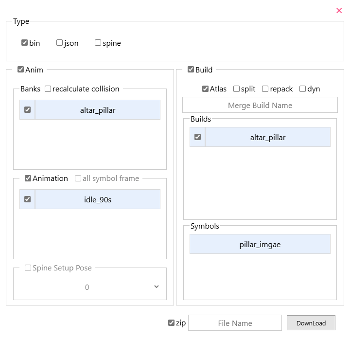

## Import

1. Click the `open` button, and you can select the imported animation file in the pop-up interface to import it.

2. Or directly **drag the file** to the browser.

File formats that can be processed: json, bin, tex, dyn, zip

 

## export

Click the `Export` button, and you can select the export settings in the pop-up export interface, and finally click the `Download` button to download the exported file. The export interface is shown below:

### Type options

1. json: Export animation files to json format.

2. bin: Export animation files to bin format for use in games.

3. spine: Export animation files that can be used in the spine editor.

### Anim Options

1. Check the box to indicate whether to export the content.

2. `ecalculate collision`: next to Banks can recalculate the collision box data of anim, and the corresponding Build must be checked.

3. `all symbol frames` and `Spine Setup Pose`: Used when exporting animation files in Spine format, see [Ds Animation convert to Spine Animation](/en/spine/export-import#Ds-Animation-convert-to-Spine-Animation)

### Build Options

1. Check the box to indicate whether to export the content.

2. `Atlas`: Export the tex texture set.

3. `spit`: Split the atlas into separate images.

4. `repake`: Repack the tex texture set. This button needs to be checked when making changes to the image.

5. `dyn`: Export as a dyn format animation file.

6. `Merge Build name` input box: When multiple builds are checked, multiple builds will be merged into one build export. You can enter the name of the merged build.

### Zip Options

1. The check box indicates whether to compress the exported file into zip format.

2. `File Name` input box: Enter the zip file name.

    

