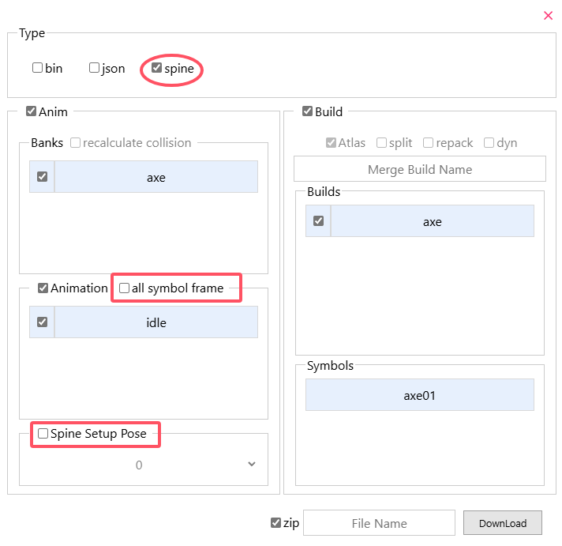
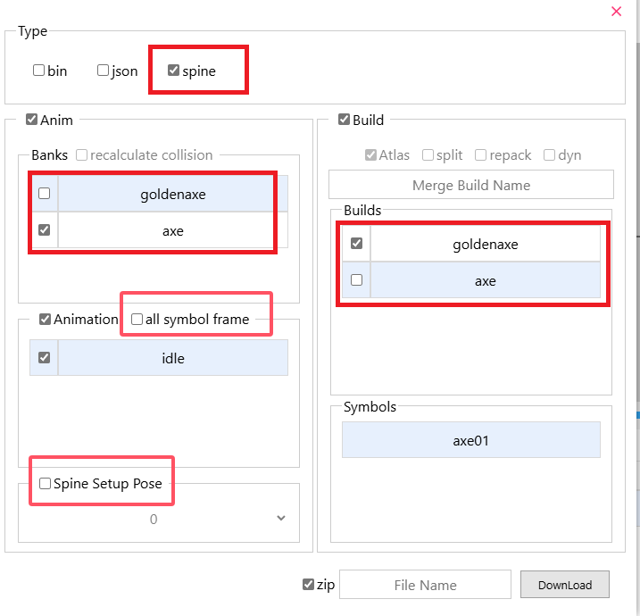
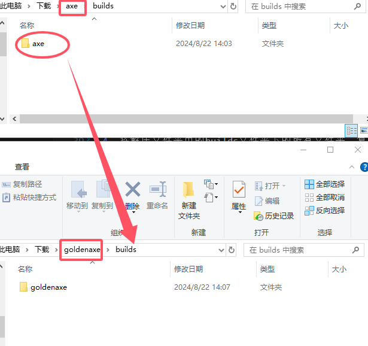
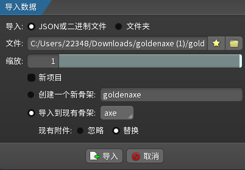
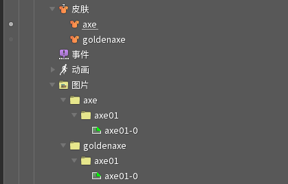

## Spine Animation convert to Ds Animation

1. Drag the zip file obtained in the [previous step](/en/spine/format.html#Export-File) into the website.
2. Click the `export` button and select type as `bin`，**Check the `repack` button**。
3. Check other buttons if you need. For button functions, please refer to [Animation Tool Export](/en/anim-tool/export)。
4. Click the `Download` button to download the file.

 
 

## Ds Animation convert to Spine Animation

1. As shown below, select the Don't Starve animation file (this ues `axe.zip`，in the `Don't Starve Together\data\anim`)，select type as `Spine` and Click the `export` button.

2. Click the `Download` button to download the file.

3. Unzip the downloaded zip file into a folder, drag the json file into the Spine editor.

4. In the Spine editor, enable the corresponding skin. If the pose is not exported, you need to switch to the animation editing interface to see the animation.

5. Optional functions, buttons in the rectangular selection box below:
    1. `all symbol frames`：Export all images under the same symbol.

    2. `Spine Setup Pose`：Select a frame of an animation as the initial pose.

    

### Adding skins to existing Spine projects
Usage scenario: In the above, a Spine project has been exported and opened. Now you need to add the new build as a skin to the project.

Take `goldenaxe.zip` as an example (In the `Don't Starve Together\data\anim`), Here are the steps:

1. Drag `goldenaxe.zip` and `axe.zip` into the website

2. The animation data selected in the export options must **include** the animation data of the previous project, and the optional options are the same as the previous project.

    As shown in Figure 1: So select bank as `axe`, select `goldenaxe` as build, uncheck the optional button. And download the file.

3. Unzip the downloaded zip file into a folder.

4. As shown in Figure 2: Copy all folders under the builds folder in the unzipped folder to the builds folder of the previous project.

5. Drag the json file into the Spine editor with the previous project open.

    As shown in Figure 3: In the pop-up window, uncheck the new project, select Import to existing skeleton, select Replace existing attachments, and click Import.

6. The final result is shown in Figure 4.

    
    
Figure 1

    
    
Figure 3

    
    
Figure 3

    
    
Figure 4

