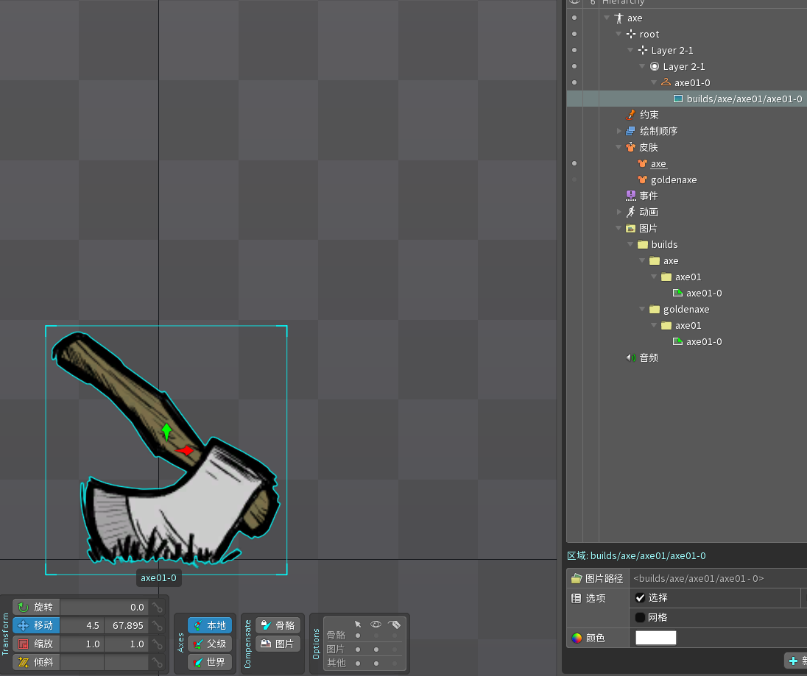

<h2>Note: All names mentioned in this document must not contain special characters.</h2>

Example File:[axe-example](https://github.com/Jerry457/dont-starve-anim-tool-document/tree/main/docs/assets/spine-anims/axe-example.zip)

## Image file name format

1. The root directory name of the image file **must** be `builds`

2. Put different build folders in each builds folder, and folder name is the `build name`.

3. Put different symbol folders in each build folder, and the folder name is the `symbol name`.

4. Put different png images in each symbol folder, ，image name format is `{symbolName}-{num}.png`，num starts from 0 and can be discontinuous。

As shown in the following image:
1. In the left picture, In builds folder have two build folders, name is `axe` and `goldenaxe`.

2. Each build folder has a symbol folder, name is `axe01`.

3. Has a iamge in the symbol folder, name is `axe01-0.png`.

The final compile result is as shown in the right image. There are three builds, each with a symbol, name is `axe01`.

    
    

## Image attachment and duration

> Node: deal about duration，such as weapons, tools need this。

1. You need to use the image attachment in the spine, The **anchor point** data of the image is the `x, -y` of the local coordinate system movement offset data of the **attachment transformation** of the image (when it is first read by the program). All subsequent transformations of the image will be automatically calculated and animated based on this data.

2. The default image duration is 1，If you need to modify the duration，The image needs to be placed under a skin placeholder，skin placeholder name format is `{symbolName}-{num}`，If this num is greater than the num in the image name, then the duration will be calculated.

3. If you need to manually fix the image data, you need to put a build.json in the build folder (you can see an example by unpacking the ds anim file).

As shown in the following figure:

The image anchor point data of axe is `x = 4.5, y = 67.895`, and the corresponding x and y data after compile are `x = 4.5, y = -67.895`.

The image anchor point data of goldenaxe is `x = 442.8, y = 109.51`, and the corresponding x, y data after compile is `x = 442.8, y = 109.51`.

    
    
    
    

## Animation name format

1. All animations must be placed in a folder. The root directory of the folder is named bank, and subdirectories will be added to the animation name, as shown below:

    
    

2. The slot name corresponds to the layer name in the animation. The format of the slot name is `{layerName}-{num}`. The tool will automatically remove the numeric suffix `-{num}` when packaging (optional. If no match is found for `-{num}`, the slot name is used as the layer name).

## Export File

1. According to the settings in Figure 1, export the json file. The json file needs to be placed in the same directory as the [builds folder](#image-file-name-format).

2. As shown in Figure 2, compress the exported json file and builds folder into a zip file (do not use window compression).

3. Drag the zip file into the website to automatically compile it, and you can preview and edit the packaged compilation on the website.

    
    
 Figure 1 

    
    
 Figure 2 

