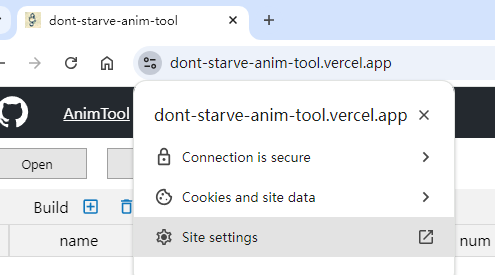
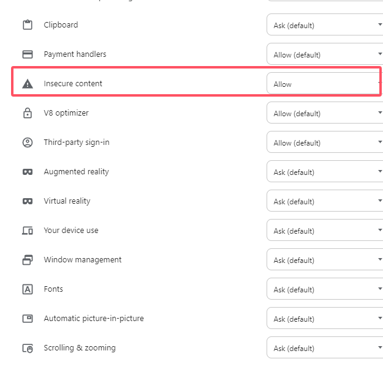
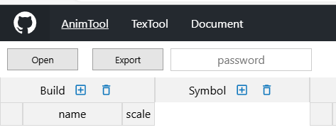

## Subscription

This tool allows you to compile Spine animation files into a format compatible with "Don't Starve" and to convert "Don't Starve" animation files for import into Spine Editor for editing.

Compiling Spine files into a format for "Don't Starve" will not preserve skeletal animation data, so please ensure that you keep the original project files.

Unpacking "Don't Starve" files into a Spine project will not export skeletal data; you will need to manually recreate the skeleton. Some complex animation packs may export with inaccurate transformations, requiring manual adjustments.

Spine-related features are a paid service. Please contact the author for purchase. Dscord: https://discord.gg/78Y4FaGq3U.

Please note that there are no refunds service.

## Enable Features

1. Open the tool website:

[https://dont-starve-anim-tool.vercel.app/](https://dont-starve-anim-tool.vercel.app/) or

[https://dont-starve-anim-tool.pages.dev/](https://dont-starve-anim-tool.pages.dev/)

 
 
2. Click the button to the left of the URL，Click `Site Settings`。

    

 
 
3. In the pop-up page, scroll to the bottom and set the `Insecure content` content to Allowed.

    

 
 
4. Enter key in the password input box in the figure below to use Spine features.

    

