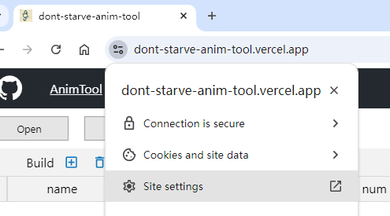
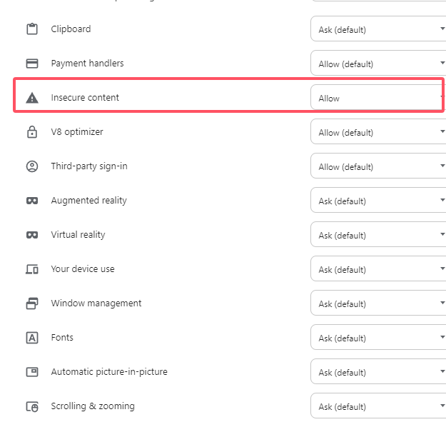
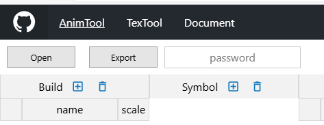

## Enable Features

1. Open the tool website:

[https://dont-starve-anim-tool.vercel.app/](https://dont-starve-anim-tool.vercel.app/) or

[https://dont-starve-anim-tool.pages.dev/](https://dont-starve-anim-tool.pages.dev/)

 
 
2. Click the button to the left of the URL，Click `Site Settings`。

    

 
 
3. In the pop-up page, scroll to the bottom and set the `Insecure content` content to Allowed.

    

 
 
4. Enter key in the password input box in the figure below to use Spine features.

    

