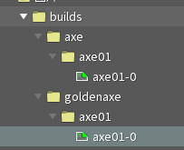
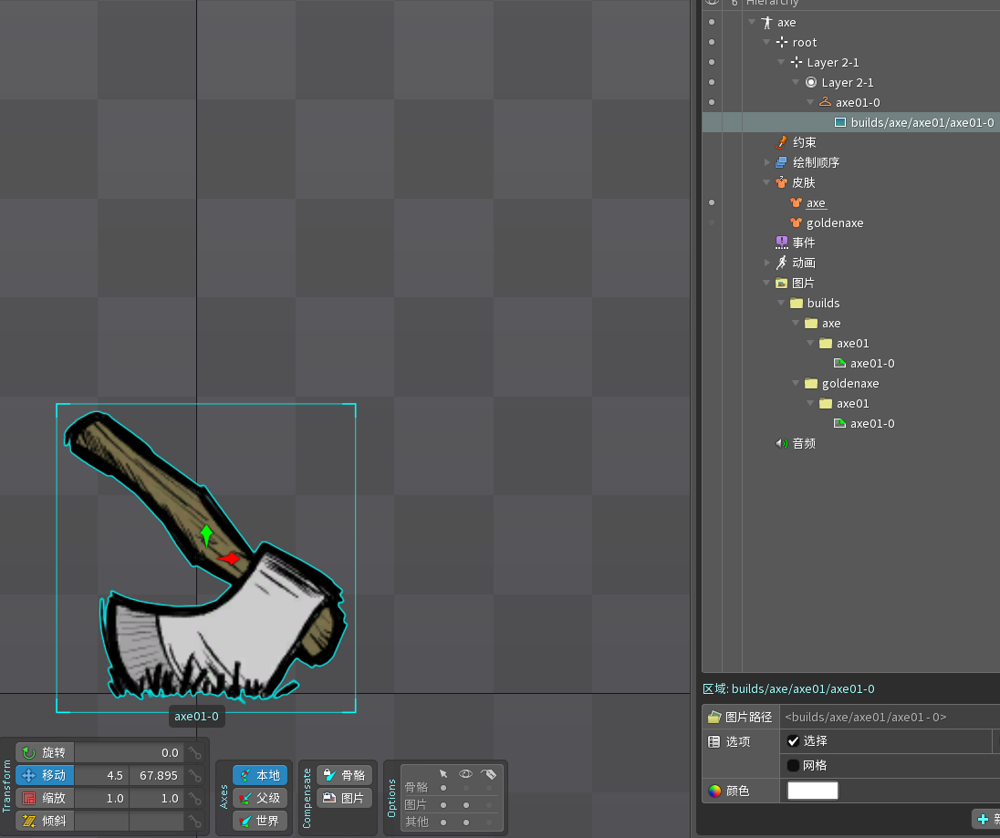
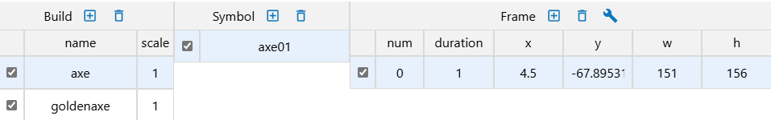
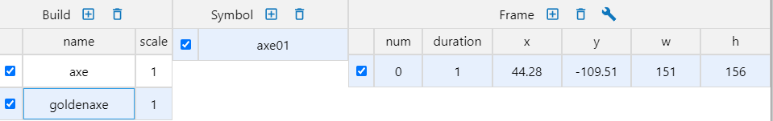
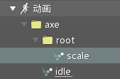
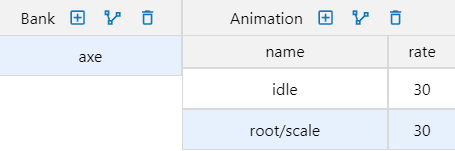

## 1. 图片文件目录命名规范

1. 图片的文件根目录名必须为builds
2. builds下存放不同build文件夹，每个文件夹名字是build的名字
3. 在每个build文件夹里放入不同的symbol文件夹，文件夹名是symbol名字
4. 在symbol名里存放图片，图片名字的格式必须为 `{symbolName}-{num}.png`，num从0开始，可以不连续

如下图所示:

1. 左图中builds文件夹里有两个build文件夹，分别为axe，goldenaxe
2. 每个build文件夹中都有一个symbol文件夹，命名为axe01
3. symbol文件夹里有一张图axe01-0.png

最后打包的结果如右图，有三个build,每个build都有一个名为axe01的symbol

    
    

## 2. 图片导入

> ps: 处理swap_object，也就是手持武器贴图时需要使用，如果不使用原版动画解包素材，只是自己做动画可以不用管这个

1. 需要将让图片附件在spine中使用到，图片的锚点数据是该图片(第一次被程序读到时的)的**附件变换**的**本地坐标系**移动**偏移数据**的x，-y，之后该图片的所有变换都会基于这个数据自动计算动画
2. 默认图片的duration是1，如果需要修改duration，需要将图片挂在一个皮肤占位符下，皮肤占位符名字的格式必须为`{symbolName}-{num}`，这个num大于图片名字中的num，那么就会计算duration
3. 如果需要手动固定图片数据，需要在该builds文件夹下放入一个build.json (这个解包原本动画可以看到例子)

如下图所示：

axe的图片锚点数据是x = 4.5，y = 67.895，对应打包后的x, y数据就是x = 4.5，y = -67.895

goldenaxe的图片锚点数据是x = 442.8，y = 109.51，对应打包后的x, y数据就是x = 442.8，y = 109.51

    
    
    
    

## 3. 动画命名规范

1. 所有动画必须放在文件夹下，文件夹根目录名为bank名，子目录会添加到animation名中，如下图所示

    
    

2. 插槽名对应动画中的图层名(layer)，插槽名的格式为`{layerName}-{num}`，在打包时自动去除数字后缀`-{num} `（可选，如果没有匹配到`-{num}`，则使用插槽名作为图层名）
