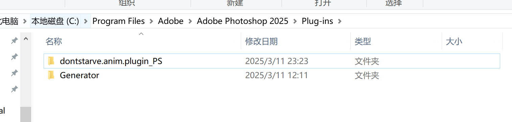

## Ps插件安装

找到ps根目录下的`Plug-ins`文件夹，将插件压缩包解压到该文件夹，重启ps后即可看到插件面板。

    

## 导入psd文件

1. 如果有psd模板文件，直接打开模板文件使用，跳过此步骤，不需要导入。

2. 将饥荒的动画[导入](/zh/anim-tool/guide.html#导入)到网页中

3. 点击`export`按钮，再弹出的页面选择`psd`，在左边的Anim中选择其中一帧，点击`Download`按钮，下载导出的`zip`文件。

4. 在ps插件面板点击`Open`按钮，选择上一版下载的`zip`文件，点击`Import`按钮，即可导入psd文件。

## 开始使用

1. 找到**绿色图层组**下方的`[Image]`图层，在上方新建一个`[Image1]`图层，绘制图像

2. 不需要的图层组可以直接删除，或者标记为红色，导出的时会自动忽略

3. 绘制完成后导出，将导出的压缩包上传至[网站](/zh/anim-tool/introduce.html#快速上手)

4. 在网站进行图片的[打包](/zh/anim-tool/guide.html#build选项)

## 注意事项

1. 可以随意拓展画布

2. 只能读取普通像素图层(如果图层有透明度，蒙版等，请先将其转换为普通像素图层)

3. 需要缩放图像时，请使用插件的缩放功能，而不是使用ps的图像缩放

4. 在移动图像时候，请确保移动整个图层组而不是`[Image]`图层，保证锚点和图像的相对位置正确。

5. 请勿修改有颜色的图层的名称以及图像锚点的名称。
