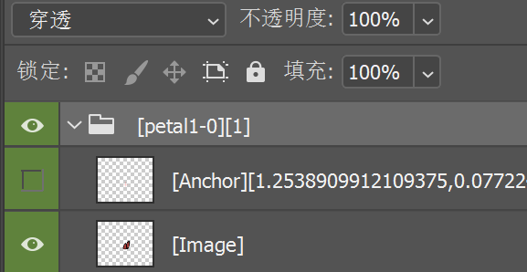
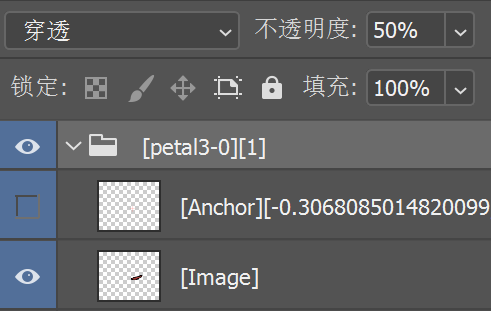

## 图层格式规范

1. 使用**颜色标记**的**图层组**，用来对应饥荒动画build文件中的图像

2. 图层组的命名规范: `[symbolName-frameNumber][duration]`，一般由程序自动生成，不需要手动修改。

3. 每个被识别的图层组中都有一个`[Image]`图层和一个`[Anchor]`锚点图层，分别对应饥荒动画build文件中的图像和图像的锚点。

    - **在导出时程序会识别图层组中的第一个[Image]开头的图层，并且自动计算与锚点图层的相对位置。**

    - **在移动图像时候，请确保移动整个图层组而不是`[Image]`图层，保证锚点和图像的相对位置正确。**

    - **锚点图层名记录的是变换数据，请不要修改。**

4. 图层组的颜色标记：

   - 绿色：源图像（导出的图像）

    

        
    

   - 蓝色：仅预览的图像（在导出的时跳过）, 一般为半透明显示

   

       
   

   - 红色：忽略的图像（一般用来提示错误信息的图层）
