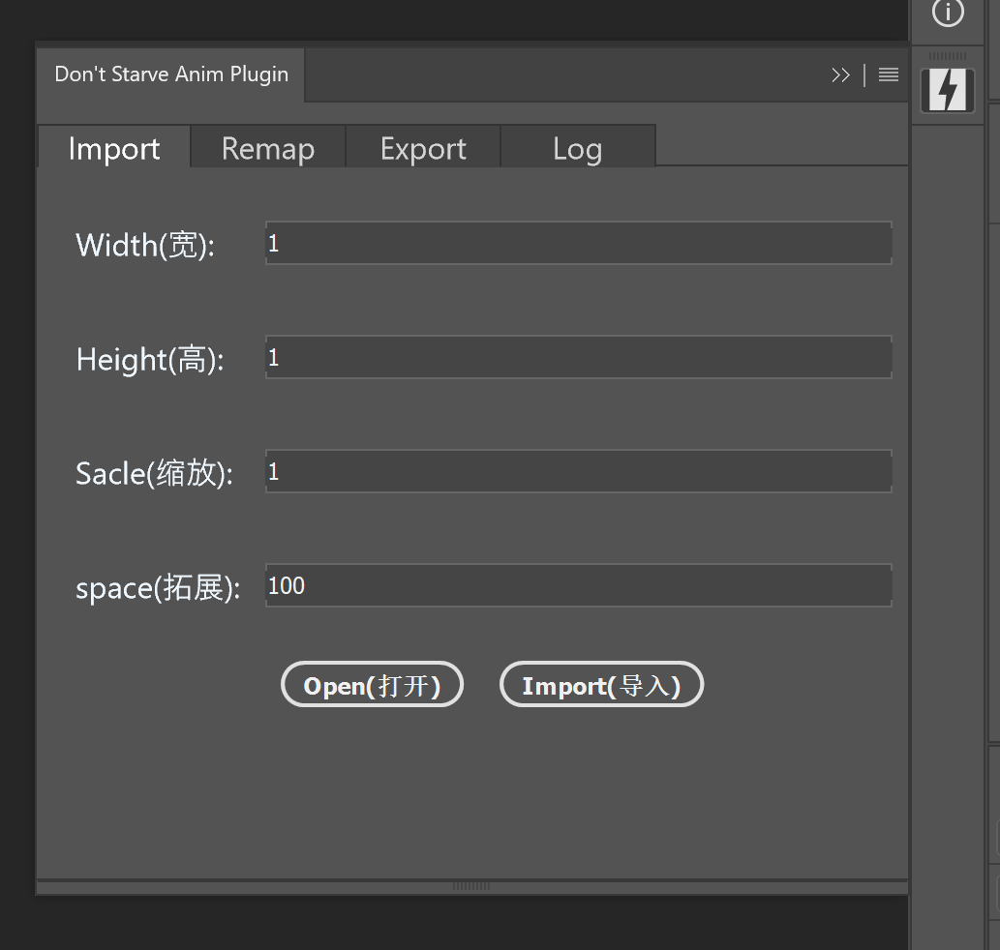
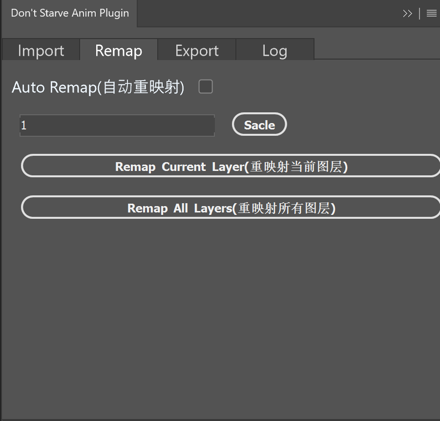
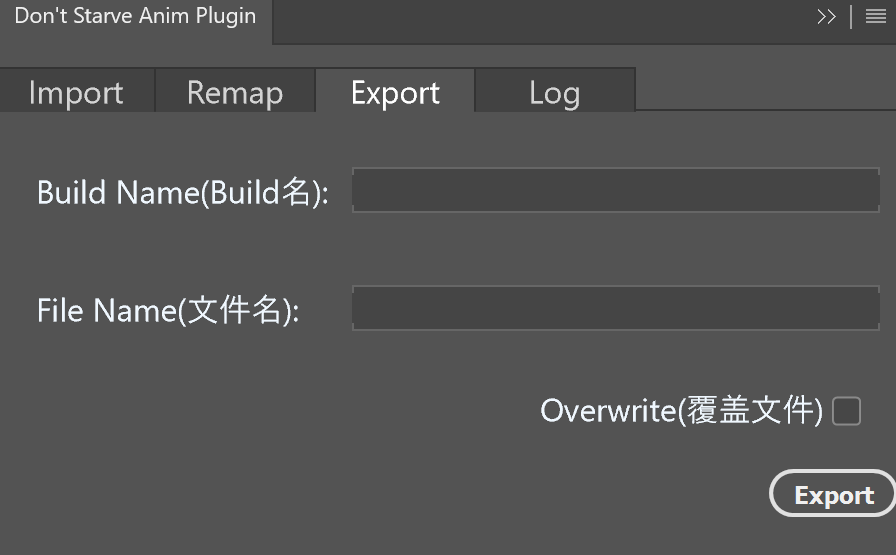

### 导入界面

可以在导入时修改缩放的比例，以及周围的空白区域大小。

    

 

### 功能界面

- `Auto Remap`: 自动重映射，可以将修改的贴图自动应用到所有相同的贴图，用于预览。(性能较差，谨慎使用)

- `sacle`按钮：将已导入的文档整体缩放。

- `Remap Current Layer`: 单独重映射当前层，将当前选择的图层的贴图应用到所有相同的贴图，用于预览。(性能较差，谨慎使用)

- `Remap All Layers`: 重映射所有层，将所有层的贴图应用到所有相同的贴图，用于预览。(性能较差，谨慎使用)

    

 

### 导出界面

- `Build Name`: 导出的Build名称。

- `Zip Name`: 导出的zip文件名称。

- `Overwrite`: 是否覆盖已有文件。

    

