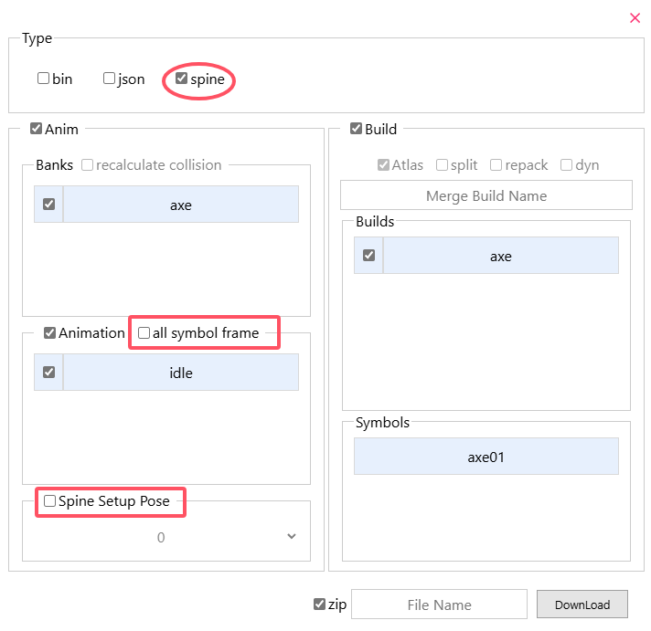
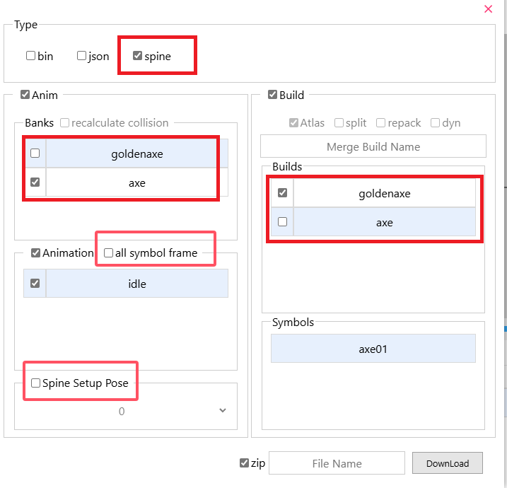
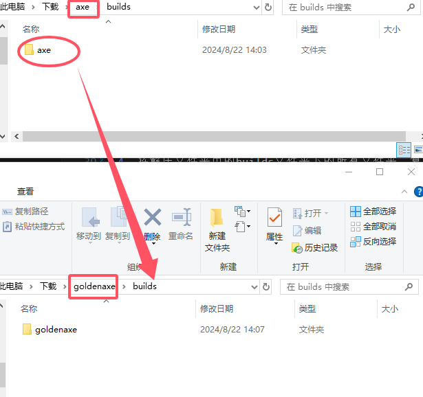
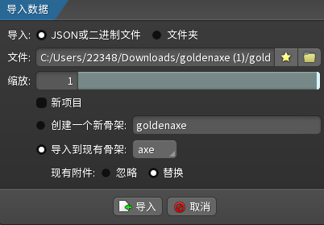
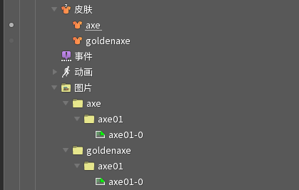

## Spine转饥荒动画

1. [将上一步](/zh/spine/format.html#导出文件)得到的zip文件，拖入网站中。
2. 点击export按钮，选择type为bin，**勾选repack按钮([否则没有tex贴图](/zh/spine/errors#问题1))**。
3. 勾选其他需要的按钮，按钮功能请自行见[动画工具导出](/zh/anim-tool/guide#导出)。
4. 点击Download按钮，下载文件。

 
 

## 饥荒动画转Spine

1. 如下图，选择饥荒动画文件（这里选择的是axe.zip文件，位于Don't Starve Together\data\anim文件夹下），点击export按钮，选择type为Spine。
2. 点击Download按钮，下载文件。
3. 将下载好的zip文件，解压到文件夹中，将其中的json文件拖入Spine编辑器中，在皮肤栏中选择对应的皮肤。

4. 可选功能，下图矩形选框中的按钮：
    1. `all symbol frames`：导出同一symbol下的所有图。

    2. `Spine Setup Pose`：设置初始姿势，可选择某个动画的某一帧作为初始姿势。

    

### 附加皮肤到已有Spine项目
使用场景：在上文中，已经导出并且打开了一个Spine项目，现在需要将新的build作为皮肤添加到项目中。

以goldenaxe.zip为例（位于Don't Starve Together\data\anim文件夹下），步骤如下：

1. 将goldenaxe.zip和axe.zip拖入网站中。

2. 导出选项中的选择动画数据需要**包含**上一个项目的动画数据，可选项和上一个项目一致。
    如图1：因此选择bank为axe，选择goldenaxe为build，不勾选可选按钮。并且下载文件。

3. 将下载好的zip文件，解压到文件夹中。

4. 如图2：将解压文件夹中的builds文件夹下的所有文件夹，复制到上一个项目的builds文件夹下。

5. 将其中的json文件，并且拖入到已经打开之前项目的Spine编辑器中。
    如图3：在弹出的窗口中，取消勾选新项目，选择导入到现有骨架，现有附件选择替换，点击导入。

6. 最后的结果如图4所示。

    
    
图1

    
    
图2

    
    
图3

    
    
图4

