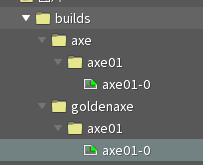

<h2>注意：本文中所有提到的命名均不能出现中文字符和特殊字符。</h2>

示例文件:[axe-example](https://github.com/Jerry457/dont-starve-anim-tool-document/tree/main/docs/public/spine-anims/axe-example.zip)

## 图片文件目录命名规范

1. 图片的文件根目录名必须为builds。

2. builds下存放不同build文件夹，每个文件夹名字是build的名字。

3. 在每个build文件夹里放入不同的symbol文件夹，文件夹名是symbol名字。

4. 在symbol名里存放图片，图片名字的格式必须为 `{symbolName}-{num}.png`，num从0开始，可以不连续。

如下图所示：
1. 左图中builds文件夹里有两个build文件夹，分别为axe，goldenaxe。

2. 每个build文件夹中都有一个symbol文件夹，命名为axe01。

3. symbol文件夹里有一张图axe01-0.png。

最后打包的结果如右图，有三个build，每个build都有一个名为axe01的symbol。

    
    

## 图片导入

> ps: 处理swap_object，也就是手持武器贴图时需要使用，如果不使用原版动画解包素材，只是自己做动画可以不用管这个。

1. 需要将让图片附件在spine中使用到，图片的锚点数据是该图片(第一次被程序读到时的)的**附件变换**的**本地坐标系**移动**偏移数据**的x，-y，之后该图片的所有变换都会基于这个数据自动计算动画。

2. 默认图片的duration是1，如果需要修改duration，需要将图片挂在一个皮肤占位符下，皮肤占位符名字的格式必须为 `{symbolName}-{num}`，这个num大于图片名字中的num，那么就会计算duration。

3. 如果需要手动固定图片数据，需要在该builds文件夹下放入一个build.json (这个解包原本动画可以看到例子)。

如下图所示：

axe的图片锚点数据是x = 4.5，y = 67.895，对应打包后的x， y数据就是x = 4.5，y = -67.895。

goldenaxe的图片锚点数据是x = 442.8，y = 109.51，对应打包后的x， y数据就是x = 442.8，y = 109.51。

    
    
    
    

## 动画命名规范

1. 所有动画必须放在文件夹下，文件夹根目录名为bank名，子目录会添加到animation名中，如下图所示：

    
    

2. 插槽名对应动画中的图层名(layer)，插槽名的格式为 `{layerName}-{num}`，在打包时工具会自动去除数字后缀 `-{num} `（可选，如果没有匹配到 `-{num}`，则使用插槽名作为图层名）。

## 导出文件

1. 按照图1设置，导出json文件, json文件需要放在[builds文件夹](#_1-图片文件目录命名规范)同级目录下。

2. 如图2所示，将导出的json文件和builds文件夹压缩为zip文件（不要使用window自动压缩）。

3. 将zip文件拖入网站中，可自动编译，并且能在网站上预览和编辑打包后的编译。

    
    
 图1 

    
    
 图2 

