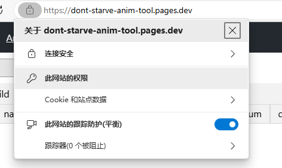
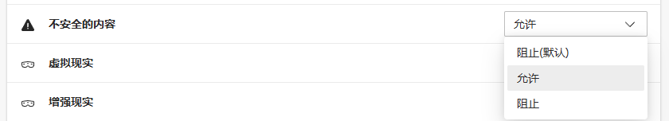
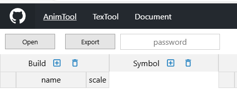

## 购买订阅

1. 使用本工具，可以将Spine动画文件编译为饥荒可用的格式，并且可以将饥荒动画文件解包为Spine项目导入Spine Editor中编辑。

2. 将Spine文件编译为饥荒可用的格式，将不会保留骨骼动画等数据，请注意保留工程文件。

3. 将饥荒文件解包为Spine项目，不会导出骨骼数据，需要手动自建骨骼。一些复杂的动画包，可能导出变换不准确，需要手动调整。

4. Spine相关功能为付费项目，请联系作者购买。QQ: 2234834467。

5. 请悉知，无退款服务。

## 启用功能

1. 打开工具网站：

[https://dont-starve-anim-tool.vercel.app/](https://dont-starve-anim-tool.vercel.app/) 或者

[https://dont-starve-anim-tool.pages.dev/](https://dont-starve-anim-tool.pages.dev/)

 
 
2. 点击网址左边的按钮，点击此网站的权限。

    

 
 
3. 在弹出的页面中，拉到最底部，将不安全的内容改为允许。

    

 
 
4. 在下图password输入框中输入key即可使用。

    

