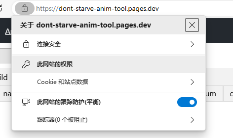
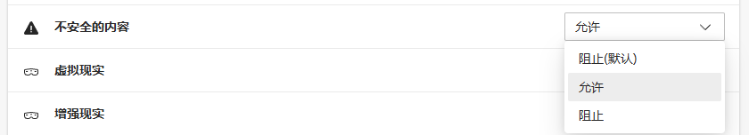

## 启用功能

1. 打开工具网站：

[https://dont-starve-anim-tool.vercel.app/](https://dont-starve-anim-tool.vercel.app/) 或者

[https://dont-starve-anim-tool.pages.dev/](https://dont-starve-anim-tool.pages.dev/)

 
 
2. 点击网址左边的按钮，点击此网站的权限。

    

 
 
3. 在弹出的页面中，拉到最底部，将不安全的内容改为允许。

    

 
 
4. 在下图password输入框中输入key即可使用。

    

